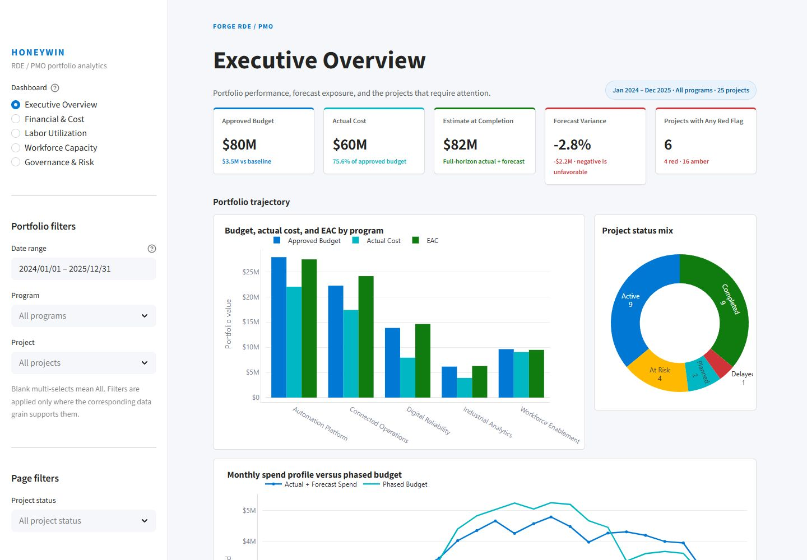

# HoneyWin RDE / PMO Portfolio Analytics

HoneyWin is a reproducible synthetic RDE/PMO analytics portfolio with two
presentation layers: an interactive Streamlit application and an audited
Microsoft Power BI implementation. It demonstrates financial control, labor
utilization, workforce capacity planning, milestone governance, and risk
management without using confidential or real Honeywell operating data.

Dashboard link: https://honeywin-powerbi-dashboard.streamlit.app/

[](docs/streamlit_gallery.md)

Review the [interactive dashboard gallery](docs/streamlit_gallery.md), the
[Power BI gallery](docs/dashboard_gallery.md), or the
[full realism and optimization audit](quality/full_realism_optimization_report.md).

## Highlights

- Five aligned analytics experiences: Executive Overview, Financial & Cost,
  Labor Utilization, Workforce Capacity, and Governance & Risk.
- Interactive global date/program/project filters plus page-specific team,
  cost, employment, location, skill, status, and risk filters where supported.
- Microsoft Fluent-inspired responsive UI with KPI cards, variance views,
  target bands, accessible conditional colors, Plotly tooltips, and detail tables.
- Eleven linked CSV tables covering 24 months, 25 projects, and 120 synthetic
  employees/contractors.
- Fixed random seed `20250810`, deterministic CSV output, and SHA-256 manifest.
- Seven controlled business anomalies with cross-table root-cause evidence.
- Audited Power BI model with 70 DAX measures, 12 semantic tables, and 20 relationships.
- Automated data, calculation, rendering, startup, link, and reproducibility tests.

## Interactive application

The Streamlit entry point is [`app.py`](app.py). It loads the committed audited
data through repository-relative paths, validates manifest row counts, caches
data loading, applies the same labor cleansing rule as Power BI, and calculates
all displayed metrics from source frames.

### Local setup

Python 3.11 or later is required.

```powershell
python -m venv .venv
.\.venv\Scripts\Activate.ps1
python -m pip install --upgrade pip
python -m pip install -r requirements.txt
```

Start the application:

```powershell
python -m streamlit run app.py
```

Streamlit will print the local URL, normally `http://localhost:8501`. The app
uses a wide layout and remains usable at narrower browser widths through
responsive card and chart wrapping.

### Application architecture

```text
app.py                              Minimal Streamlit entry point
honeywin_dashboard/data.py          Cached loading, validation, joins, filters
honeywin_dashboard/metrics.py       Pure audited KPI calculations
honeywin_dashboard/charts.py        Reusable Plotly business charts
honeywin_dashboard/filters.py       Navigation and supported filter controls
honeywin_dashboard/style.py         Fluent tokens, CSS, KPI formatting
honeywin_dashboard/pages.py         Five page compositions
.streamlit/config.toml              Deterministic local theme/server settings
tests/test_streamlit_dashboard.py   Loader, calculation, filter, and render tests
```

The Power BI theme file is the palette source for the Streamlit application, so
both presentation layers use the same primary, secondary, good, warning, and bad
status colors.

## Dataset

Default scope:

- Date range: 2024-01-01 through 2025-12-31; data as of 2025-06-30.
- 25 FORGE-style synthetic RDE projects.
- 120 synthetic employees and contractors.
- 8,172 raw labor records; 8,145 after reject-and-deduplicate cleansing.
- 11 UTF-8 Power BI-ready CSV tables.
- 7 deterministic anomaly/root-cause scenarios.

| Table | Rows | Grain |
|---|---:|---|
| `DimDate` | 731 | Calendar date |
| `DimProject` | 25 | Project |
| `DimEmployee` | 120 | Employee or contractor |
| `DimTeam` | 8 | Engineering team |
| `DimSkill` | 8 | Workforce skill |
| `BridgeEmployeeSkill` | 216 | Employee–skill association |
| `FactLabor` | 8,172 | Employee–project–week time entry |
| `FactFinancial` | 1,180 | Project–month–cost category |
| `FactMilestone` | 201 | Project milestone |
| `FactWorkforcePlan` | 768 | Month–team–skill–location snapshot |
| `FactRiskIssue` | 118 | Project risk or issue |

See the [data specification](docs/data_specification.md) and
[data dictionary](docs/data_dictionary.md) for grains, keys, definitions, and
business rules.

## Data refresh and Power BI assets

Regenerate and validate the fixed-seed data:

```powershell
python scripts\generate_data.py
python scripts\validate_data.py
python scripts\audit_realism.py --label final
python scripts\build_powerbi_model_assets.py
```

Running the generator again with the same configuration must produce
byte-identical CSV files and manifest checksums. Restart Streamlit after a data
refresh; its cached loader will validate the new manifest before rendering.

Power BI source assets are stored under `powerbi/`, including the Fluent theme,
Power Query cleansing logic, relationship/setup guidance, DAX source, generated
measure metadata, and TMDL. The local PBIX binary is intentionally excluded from
Git. See the [Power BI dashboard specification](powerbi/dashboard_spec.md) and
[measure catalog](powerbi/measure_catalog.md).

## Validation

Run the complete automated suite:

```powershell
python -m compileall -q app.py honeywin_dashboard scripts tests
python scripts\validate_data.py
python scripts\audit_realism.py --label final
python -m pytest -q
python scripts\smoke_streamlit.py
python scripts\check_repo_links.py
```

Current audited acceptance results:

- Data QA: 50 PASS, 4 expected anomaly warnings, 0 unexpected failures.
- Reproducibility and application tests: 19 passed.
- Realism audit: 0 final artificiality flags, down from 14 at baseline.
- Referential integrity: 0 orphan keys and 0 impossible-date conditions.
- Live Power BI model: 12 semantic tables (11 source tables plus `DimLocation`),
  70/70 DAX measures, 16 active and 4 inactive relationships.
- Streamlit browser review: five experiences rendered without application errors;
  1440×1000 wide captures and a 900-pixel responsive overflow check passed.

## Optional Streamlit Community Cloud deployment

This repository hosts source code and preview assets only. No external service
has been deployed or authorized.

To deploy separately through Streamlit Community Cloud:

1. Merge or select the desired GitHub branch in Streamlit Community Cloud.
2. Create an app pointing to this repository and set the entry point to `app.py`.
3. Use a supported Python version and install from `requirements.txt`.
4. Do not add secrets; this application requires none.
5. Confirm the health page, all five navigation states, and the committed QA suite
   after deployment.

A live URL will not exist until that separate hosting step is explicitly completed.

## Data classification

All project, resource, owner, sponsor, risk, financial, and workforce records are
synthetic interview/demo constructs. They are not external benchmarks, production
forecasts, or statements about Honeywell performance.
