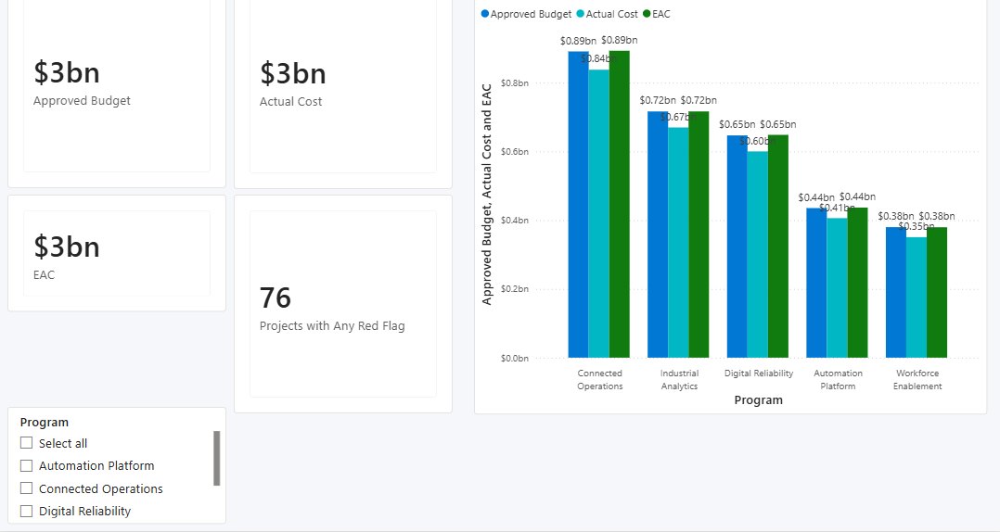
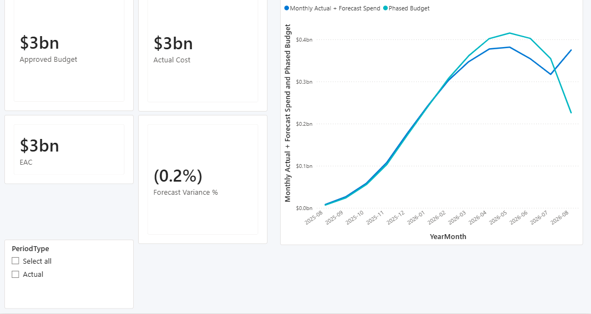
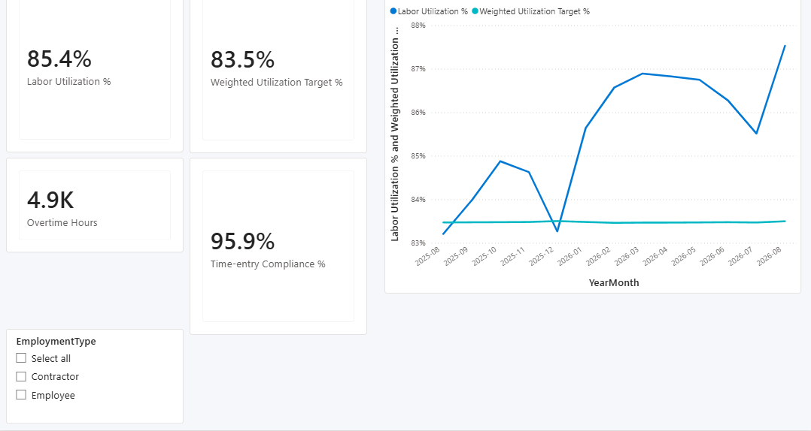
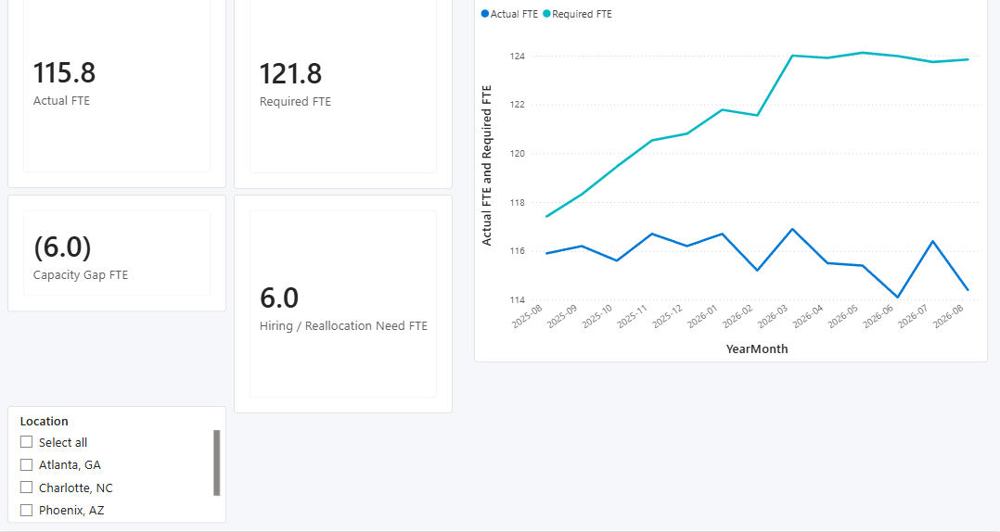
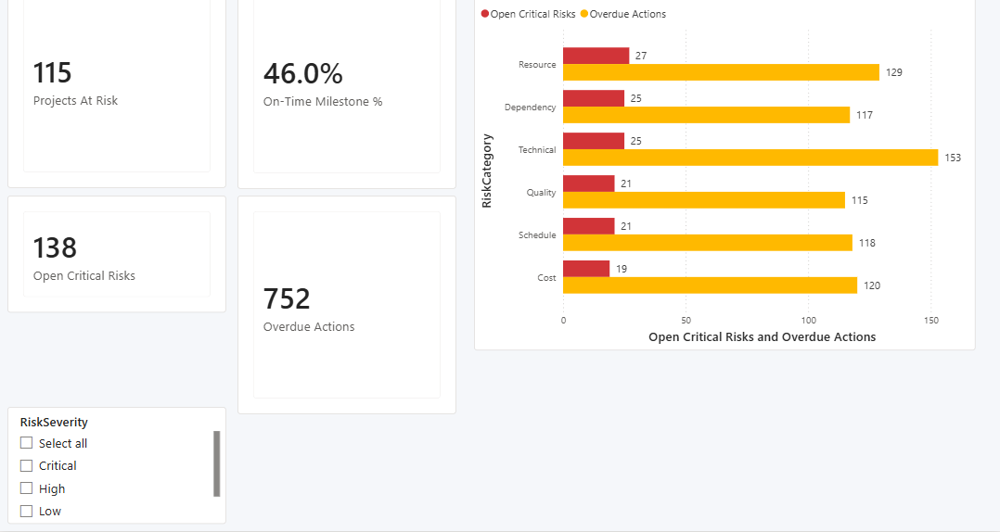

# Power BI dashboard gallery

These screenshots show the final Microsoft Fluent report at its documented
portfolio baseline: all slicers are set to **All**, no cross-highlight is active,
and each page is captured as a clean 1078×574 report-canvas view from Power BI
Desktop with the ribbon and authoring panes excluded. All names and values are
synthetic interview/demo data rather than Honeywell operating results.

## Executive Overview

Portfolio budget, actual cost, EAC, red-flag count, and program-level cost
comparison. Baseline slicer: **Program = All**.

## Financial & Cost

Budget, actual cost, EAC, forecast variance, and monthly spend versus phased
budget. Baseline slicer: **PeriodType = All**.

## Labor Utilization

Utilization versus weighted target, overtime, time-entry compliance, and the
monthly utilization trajectory. Baseline slicer: **EmploymentType = All**.

## Workforce Capacity

Actual and required FTE, capacity gap, hiring/reallocation need, and the monthly
capacity-demand trajectory. Baseline slicer: **Location = All**.

## Governance & Risk

At-risk projects, on-time milestones, critical risks, overdue actions, and
exception counts by risk category. Baseline slicer: **RiskSeverity = All**.

For definitions, sign conventions, and page-to-measure mappings, see the
[dashboard specification](../powerbi/dashboard_spec.md). For validation evidence,
see the [full realism and optimization audit](../quality/full_realism_optimization_report.md).
