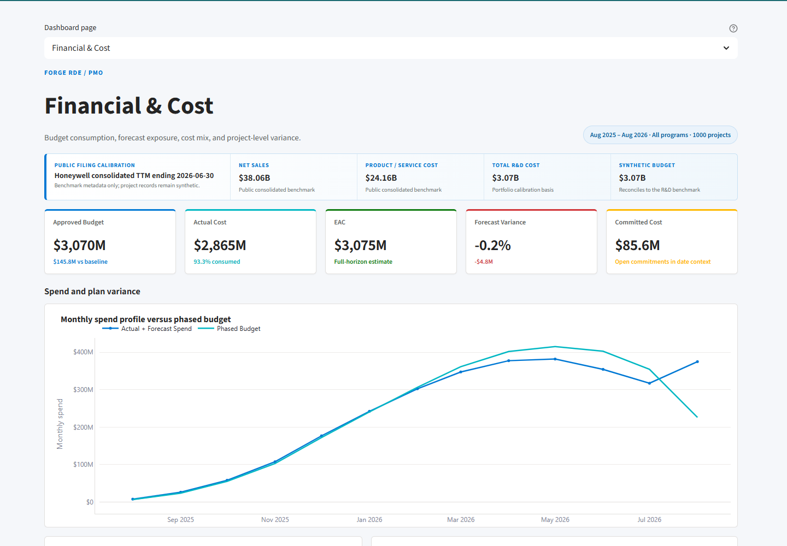
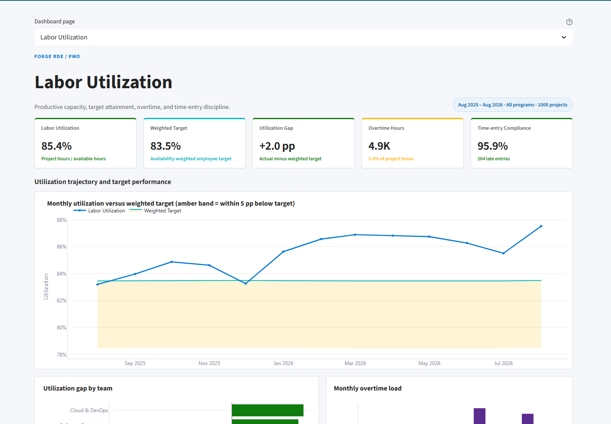
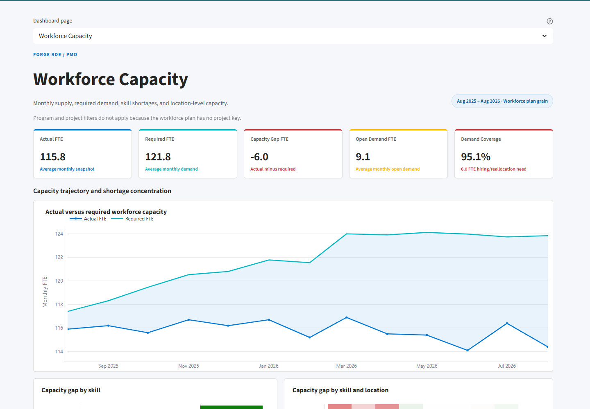
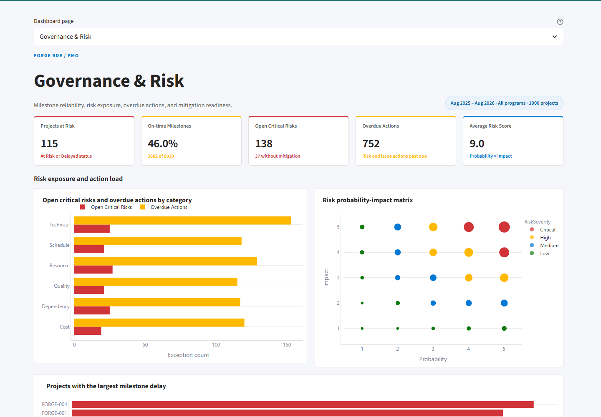

# Streamlit dashboard gallery

These application previews use the audited baseline: full date range, all
programs, all projects, and no page-specific selections. Each image was captured
from the local application at a 1440×1000 viewport after the page heading and
visuals completed rendering. All values are synthetic.

## Executive Overview

[](assets/streamlit/executive-overview.png)

Portfolio budget, actual cost, EAC, forecast variance, red flags, program-level
cost comparison, status mix, and spend trajectory.

## Financial & Cost

[](assets/streamlit/financial-cost.png)

Full-horizon EAC, budget consumption, commitments, monthly spend versus plan,
cost-category composition, and project forecast variance.

## Labor Utilization

[](assets/streamlit/labor-utilization.png)

Utilization, weighted target, target gap, overtime, time-entry compliance, the
documented five-percentage-point tolerance band, and team-level exceptions.

## Workforce Capacity

[](assets/streamlit/workforce-capacity.png)

Average monthly actual and required FTE, capacity gap, open demand, coverage,
skill shortages, and location-level capacity concentration.

## Governance & Risk

[](assets/streamlit/governance-risk.png)

At-risk projects, milestone reliability, open critical risks, overdue actions,
risk categories, probability-impact positioning, and schedule-delay exceptions.

Run the interactive version locally with:

```powershell
python -m streamlit run app.py
```

The [main README](../README.md) documents setup, architecture, refresh, testing,
and hosting. The deployed dashboard is available at
[honeywin-powerbi-dashboard.streamlit.app](https://honeywin-powerbi-dashboard.streamlit.app/);
workspace sharing settings may require Streamlit sign-in.
